
# :wave: My Profile

## 🤓 Objective
The goal of "My Profile" assignment is to give every student an opportunity build a beautiful, interactive, and responsive website on a weekly basis. This is a term-long assignment (Week 1 through Week 16), and it will count towards your **Class Participation**.

This **README** will be updated by the teaching team on a weekly basis on Wednesday evenings. Please ensure to check this **README** on Wednesdays and check what is due weekly.
## (Week 3-4) :octocat: Add Bootstrap to my beautify my profile.
1. Procrastining rn. tomorrow do.

|Tasks|Progress?|
| ------------- |:-------------:|
|BTS Fan Page|halfway|
|Krazy Tuition Center|waiting for submission...|

## (Week 2) :octocat: Beautify my profile using CSS Basics
~~This will be a piece of cake~~ I am dead inside.
1. Added some colors.
2. :grinning:Added my smiling picture:grinning:
3. Edited small table about myself :shit:
4. Youtube autoplay muted & background gif.

## (Week 1) :octocat: Git/GitHub & Your First Code Commit/Push
The goal this week is for you to understand what **Git** is and how **GitHub** works.
* Please check out this ["Git and GitHub Starter Course"](https://github.com/is216-supreme/github-starter-course).

Next, you're invited to "My Profile" classroom assignment
* If you don't have a GitHub account, **please sign up and ensure to add your SMU email address as either primary or secondary**.
* You will get a **verification email** in your SMU Inbox. Click and **verify**. Now, your GitHub account is ready!
* Click on the invite URL that your prof (or TA) provided to you. This is an invite to **My Profile** assignment.
* In your web browser, you will see this. Click **Authorize GitHub Classrom**. 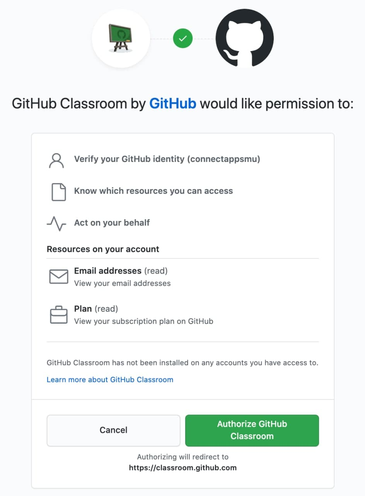
* Click **Skip to the next step **. 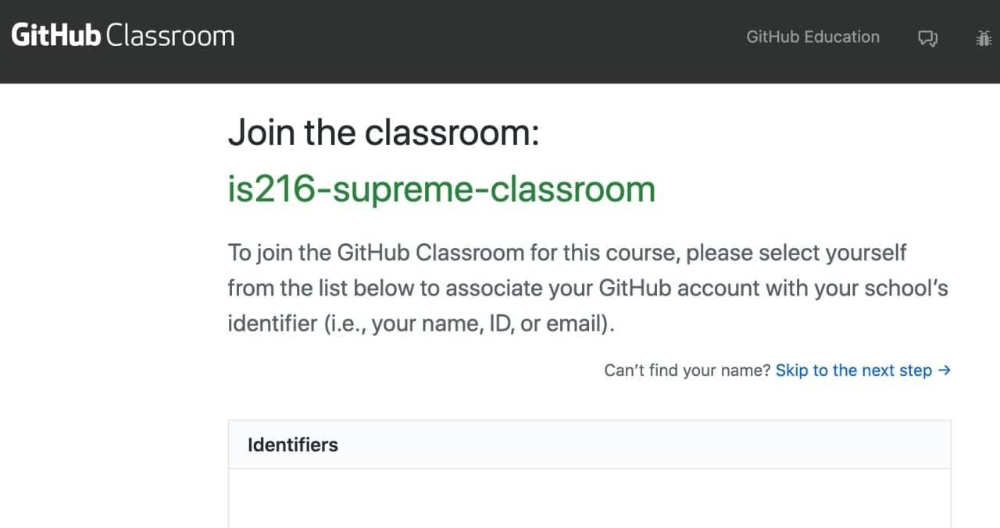
* Click **Accept this assignment**. 
* You will see this. Wait for 10 seconds and Refresh browser. 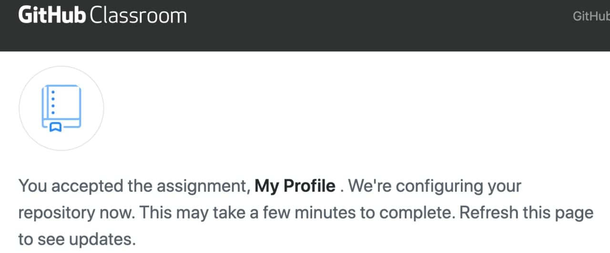
* Click **Open in Visual Studio Code**. 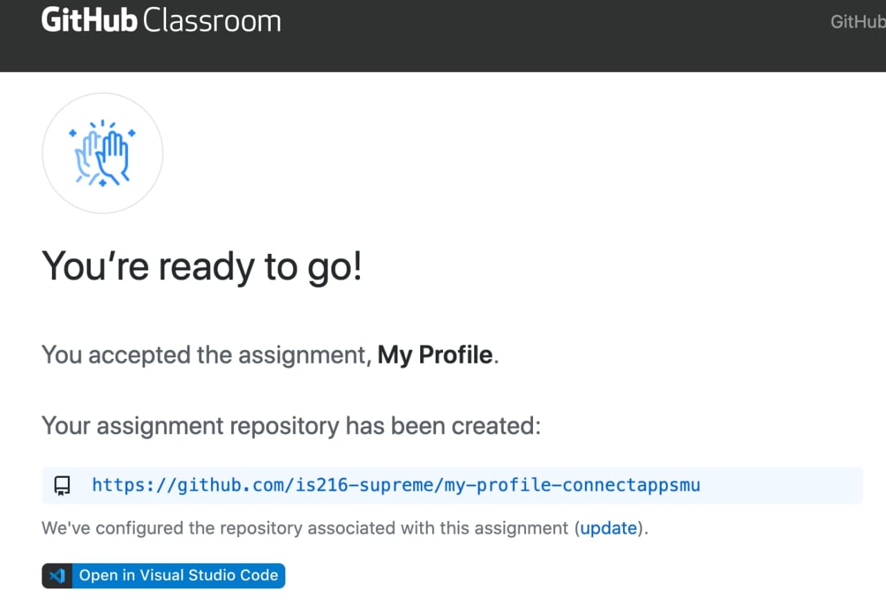
* In **Visual Studio Code**, you'll see this. Click **Install**. 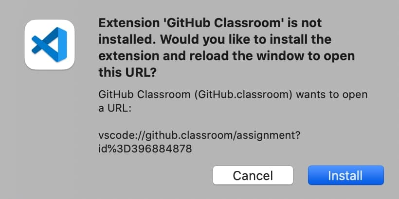
* In **web browser**, you'll see this. Click **Authorize github**. 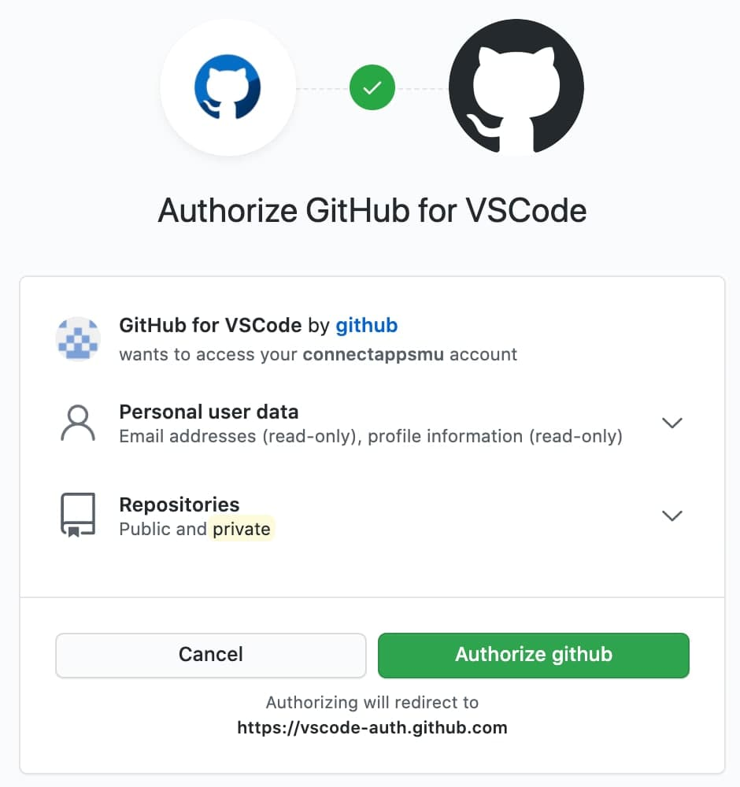
* In **Visual Studio Code**, you'll see this. Click **Open**. 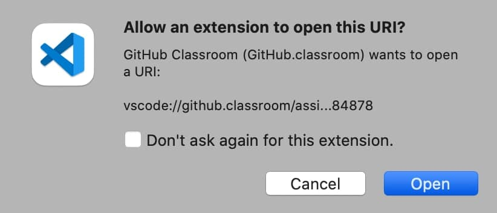
* Click **Allow**. 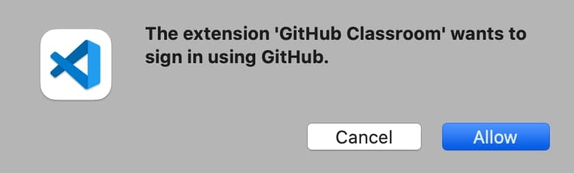
* Check **File Explorer** panel on the left. You will see these files. 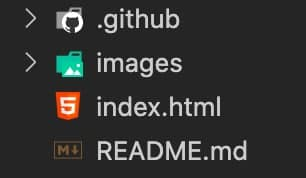

Next, let's go update your **index.html**.
* The skeleton **index.html** is just a template.
* Update **index.html** with **your information**.
* Your Github repo is **private** and is only visible to your prof and TAs.

So far, the changes you've made reside locally on your computer. Your prof and TAs cannot see them.
* Let's push your **changes** (from local computer) to your (remote) GitHub repo.
* In **GitHub**, this takes 2 steps: **1) Commit** and **2) Push**.
* ---
* First, in your web browser, go to your own **My Profile** GitHub repo. 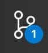
* In my case, my remote repo address is https://github.com/is216-supreme/my-profile-connectappsmu. Yours will be having a different suffix.
* ---
* In **Visual Studio Code**, look for this button on the left side. Click on it. 
* You will see this. It shows the previous file content on left (red) and new content on right (green). 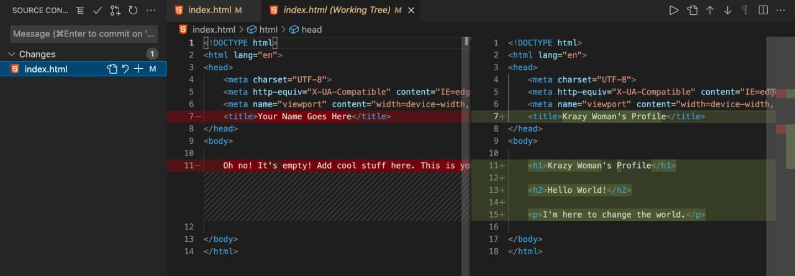
* In the top left corner, you will see. 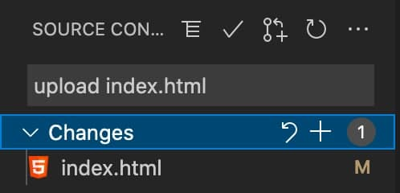
* Under **Changes**, you will see one or more files with changes made locally. In our case, we made changes to only 1 file. Click **Changes** (or index.html) and above it, in the text field, write briefly what this **commit** is for.
* When done, click the **tick** sign.
* You'll see this. Click **Yes**. 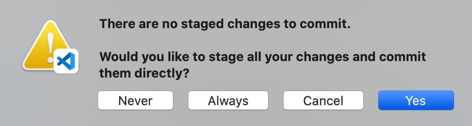
* Click on 3-dot sign. Click **Push**. 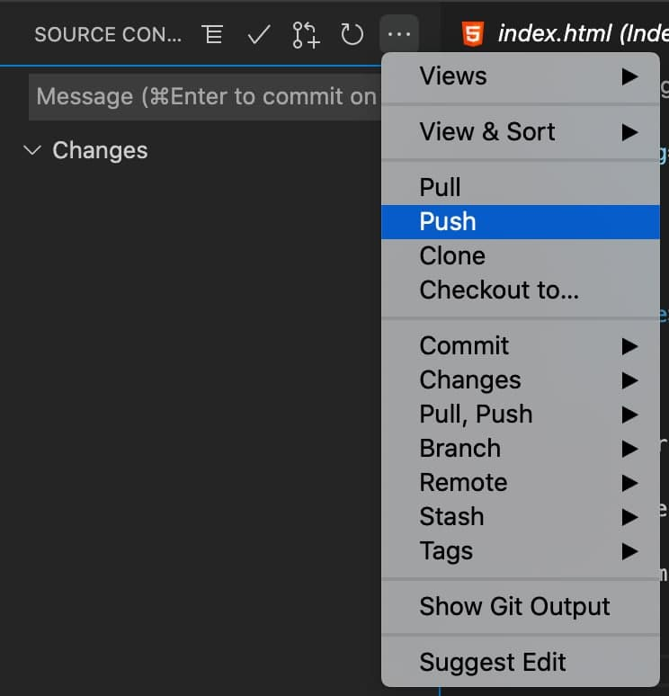
* ---- By now, your changes should've been pushed to your My Profile **remote** GitHub repo ---
* In **web browser**, go to your My Profile GitHub repo.
* Go there and click on **index.html**. Do you see the latest changes you just pushed from your local computer?
* Here's mine. Looks like it's updated! 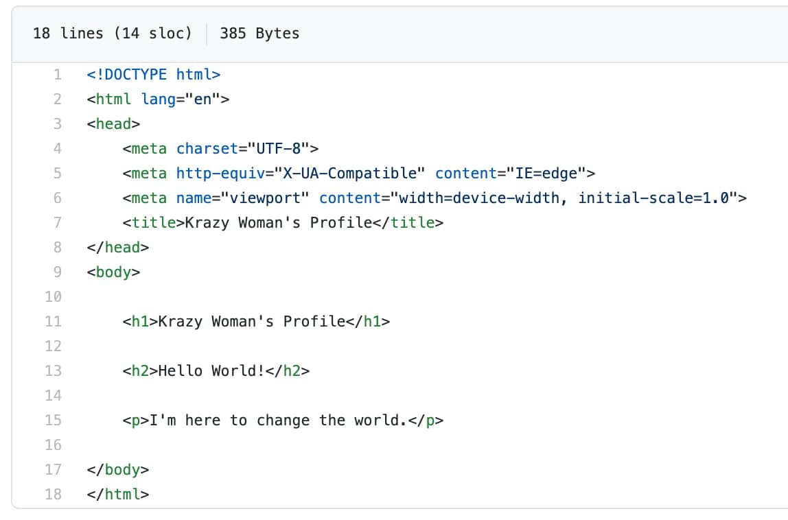

If you're stuck, please don't forget to visit **Slack** and post questions in **#troubleshoot**.

